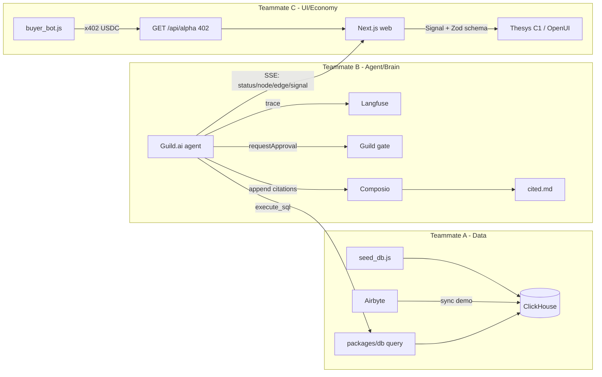

# NIGHTCRAWLER - Robust 3-Person Parallel Implementation Plan

## What we are building (purpose)

NIGHTCRAWLER is an **autonomous OSINT + "alpha broker" agent**. It ingests open-web data (flight logs, gov filings, options volume) into ClickHouse, detects an anomaly, then **autonomously runs a corroboration loop** (multiple independent SQL queries) before synthesizing a high-confidence signal. A human **approves** publication via a Guild.ai gate (liability control), the agent **publishes ground-truth citations** to `cited.md` via Composio, and the actual "alpha" payload is **sold to another agent** behind an x402/CDP crypto paywall. Langfuse traces the reasoning to prove it is rigorous analysis, not a guess.

The single most important design goal here is **parallelism**: three people must build without blocking each other. We achieve this with a **contract-first** approach - all shared interfaces (types, schemas, fixtures, HTTP API) are frozen in the first 45 minutes, then each person builds against mocks and swaps in real integrations during an integration phase.

## Decisions made (override if you disagree)

- **Repo**: pnpm + Turborepo monorepo, one top-level folder owned per person (minimal merge conflicts).
- **Storage**: ClickHouse Cloud free tier (sponsor requirement) as primary; SQLite mirror behind the _same_ `query()` interface as a zero-network fallback.
- **UI**: Thesys C1 hosted GenUI API (OpenUI Lang) with a custom `ConspiracyBoard` component; `react-flow` board as the local fallback renderer of the same data.
- **Economy**: x402 protocol (the real "402" agent payment rail) on Base Sepolia; testnet facilitator `https://x402.org/facilitator` for signup-free speed; direct `@coinbase/coinbase-sdk` USDC transfer as fallback.
- **Agent runtime**: Guild.ai TypeScript SDK for the agent + approval gate; OpenAI (or Anthropic) for the LLM; Langfuse for tracing.

## Architecture & data flow



## The frozen contracts (built together in Phase 0, then DO NOT change)

All live in `packages/contracts/` and `packages/db/`. These are the seams that let everyone work alone.

1. **DB access contract** (`packages/db`): exported `query<T>(sql: string): Promise<T[]>` + the 3 tables `flights`, `news_and_filings`, `market_anomalies` (schema from the brief, with `id`, `*_url` where useful). Same function works against ClickHouse or SQLite via env switch.
2. **Signal contract** (`packages/contracts/signal.ts`): the agent's canonical output, the boundary between B and C.

```ts
export type ConspiracyNode = {
  id: string;
  kind: "news" | "flight" | "filing" | "market" | "synthesis";
  label: string;
  detail: string;
  sourceUrl?: string;
  confidence?: number;
};
export type ConspiracyEdge = {
  id: string;
  source: string;
  target: string;
  label: string;
};
export type Citation = { source: string; url: string; quote: string };
export type Alpha = {
  action: string;
  tickers: { ticker: string; direction: "LONG" | "SHORT" }[];
  rationale: string;
}; // gated payload
export type Signal = {
  thesis: string;
  confidence: number;
  nodes: ConspiracyNode[];
  edges: ConspiracyEdge[];
  citations: Citation[];
  alpha: Alpha;
};
```

3. **ConspiracyBoard Zod schema** (`packages/contracts/conspiracyBoard.ts`): Zod schema for the custom C1/OpenUI component props (mirrors `nodes`/`edges`). B uses it to instruct/register with C1; C uses it to render. One schema, two consumers.
4. **SSE event contract** (`packages/contracts/events.ts`): `{ type: 'status'|'node'|'edge'|'approval_required'|'signal'|'done'|'error', payload: unknown }`.
5. **HTTP API contract**: `POST /api/run` -> `{ runId }`; `GET /api/stream?runId` (SSE of events above); `POST /api/approve` (or via Guild dashboard) -> resume; `GET /api/alpha?runId` -> x402-gated, returns `Signal.alpha`.
6. **Fixtures**: `packages/contracts/fixtures/mock_signal.json` (a fully-populated `Signal` for the Trump/China narrative) and `mock_events.ndjson` (a replayable SSE stream). C builds entirely against these until B is ready.
7. **`.env.local` template** + `cited.md` markdown format.

## Per-person prerequisites (acquire BEFORE coding)

### Teammate A - Data & Analytics Engine (owns `packages/db/`, `apps/ingest/`)

- ClickHouse Cloud account -> `CLICKHOUSE_URL`, `CLICKHOUSE_USER`, `CLICKHOUSE_PASSWORD` (free tier). No-key fallback: SQLite.
- (Optional/demo) Airbyte: Airbyte Cloud (`AIRBYTE_API_KEY`) or local OSS via `abctl`; a Faker/File source -> ClickHouse destination for the on-screen "sync" moment.
- Node 20+, pnpm; libs: `@clickhouse/client`, `better-sqlite3` (fallback), `@faker-js/faker`, `uuid`.

### Teammate B - Agent & Governance (owns `apps/agent/`)

- Guild.ai: `GUILD_API_KEY` + `GUILD_ORG_ID` + a workspace (Guild can broker the LLM call so the agent never sees raw keys).
- LLM: `OPENAI_API_KEY` (or `ANTHROPIC_API_KEY`).
- Langfuse: `LANGFUSE_PUBLIC_KEY`, `LANGFUSE_SECRET_KEY`, `LANGFUSE_HOST` (cloud or self-host).
- Composio: `COMPOSIO_API_KEY` + a connected GitHub account (to commit `cited.md`); filesystem-write fallback needs no key.
- Node 20+, pnpm; libs: Guild SDK (`@guildai/*`), `langfuse`, `composio-core`, `openai`, `zod`, `express` (or Hono) for the run/stream service. Consumes `packages/db` + `packages/contracts`.

### Teammate C - Visualization & Economy (owns `apps/web/`, `apps/buyer/`)

- Thesys C1 / OpenUI: `THESYS_C1_API_KEY`.
- x402 / CDP: optional CDP account (`CDP_API_KEY_ID`, `CDP_API_KEY_SECRET`) for the CDP facilitator; or use `https://x402.org/facilitator` (no signup). A Base Sepolia wallet `BUYER_PRIVATE_KEY` + `SELLER_ADDRESS`, funded with testnet USDC + ETH from the CDP faucet.
- Node 20+, pnpm; libs: `next`, `@thesysai/genui-sdk`, `@crayonai/react-ui`, `reactflow` (fallback), `x402-next` (or `@x402/express`), `x402-axios`/`x402-fetch`, `viem`, `@coinbase/coinbase-sdk` (fallback).

## Timeline (1 day, ~8 working hours)

- **Phase 0 (0:00-0:45) - ALL TOGETHER:** scaffold monorepo, write + freeze `packages/contracts` and the `packages/db` interface, agree HTTP/SSE API, commit `.env.local.example` + fixtures, push skeleton. Nobody is blocked after this.
- **Phase 1 (0:45-4:00) - PARALLEL against mocks:** A seeds DB; B builds agent emitting `Signal` (validated against fixture); C builds board + paywall against `mock_signal.json`.
- **Phase 2 (4:00-6:00) - INTEGRATE:** wire B->real `packages/db`; wire C->real `/api/stream`; replace fixture with live Signal.
- **Phase 3 (6:00-7:00) - END-TO-END:** approval gate + Langfuse trace + Composio `cited.md` + x402 buyer unlock in one run.
- **Phase 4 (7:00-8:00) - DEMO POLISH:** 3-minute dry run, dark-mode styling, record a fallback screen capture per the demo script.

## Fallback ladder (each swap is local to one package, contracts unchanged)

- Guild SDK issues -> plain `/api/approve` gate + Langfuse only.
- Thesys C1 issues -> render `Signal` with local `reactflow` board.
- ClickHouse latency/outage -> SQLite mirror via same `query()`.
- x402/CDP issues -> direct `@coinbase/coinbase-sdk` USDC transfer + manual unlock toggle.
